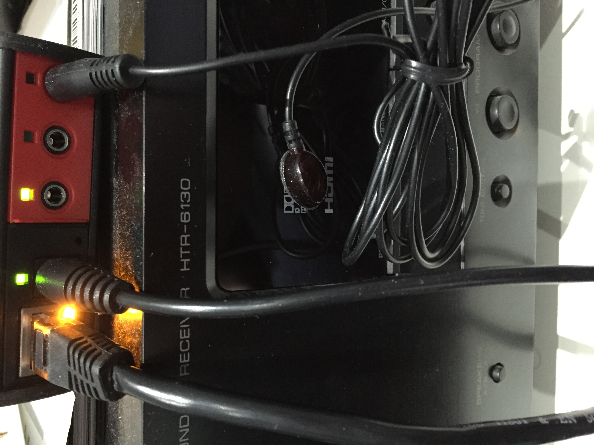
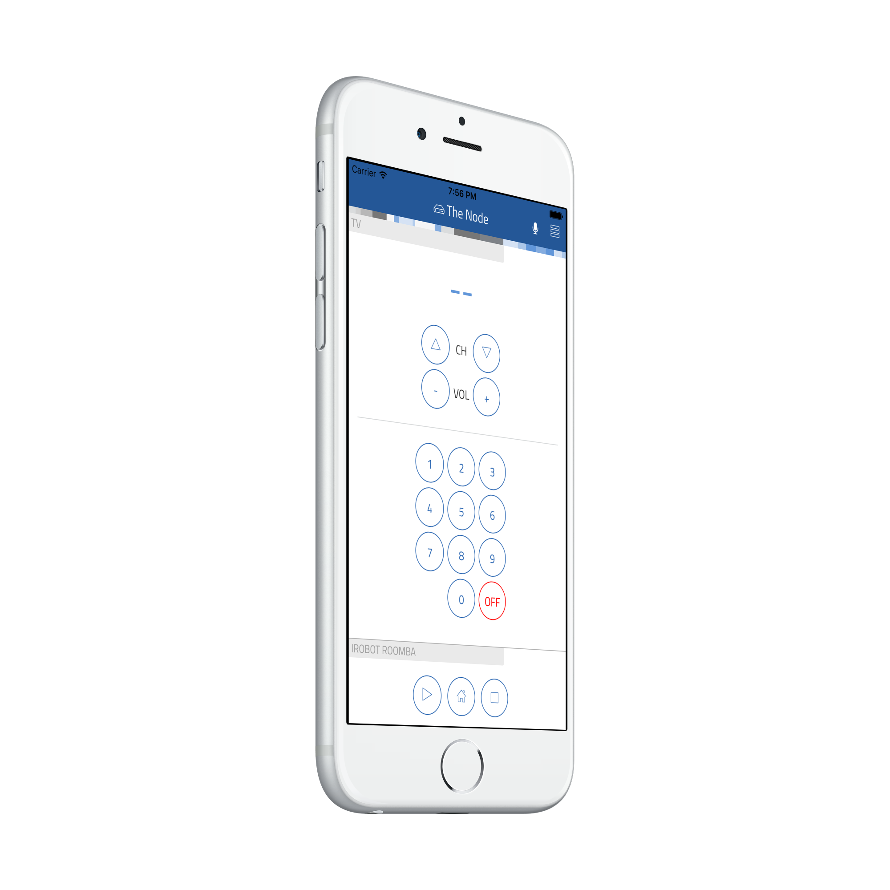

# thing-it-device-itach

[](https://nodei.co/npm/thing-it-device-itach/)
[](https://nodei.co/npm/thing-it-device-itach/)

[thing-it-node] Device Plugin for [ITach Bridges](http://www.globalcache.com/products/itach/) (e.g. Wifi/Infrared).


This allows you to 

* control the devices you usually control with your IR remotes devices from a mobile UI over the Internet,
* define complex Services, Event Processing, Storyboards and Jobs combining the IR-controlled devices with other Devices, Sensors and Actors.

by means of [thing-it-node](https://github.com/marcgille/thing-it-node) and [thing-it.com](http://www.thing-it.com).

E.g. you could switch of the TV if the motion detector has not detected any movement in the room for 10 minutes (because you fell asleep) or
start your cleaning robot with a more sophisticated schedule. 

## Installation

### Installation of NodeJS and [thing-it-node]

First, install [nodejs](https://nodejs.org/en/download/) on your computer (e.g. your PC or your Raspberry Pi Zero).

Then install **[thing-it-node]** via

```
npm install -g thing-it-node
```
Note, that depending on the access right settings on your file system you may need to invoke

```
sudo npm -g install thing-it-node 
```

instead.
 
### Initialization and Start of [thing-it-node] 

The **[thing-it-device-ti-itach]** Plugin is installed with **[thing-it-node]**, hence there is no need to install it separately.

Create a directory in which you intend to run the configuration, e.g.
 
```
mkdir ~/itach-test
cd ~/itach-test
```
and invoke

```
tin init
```

and then start **[thing-it-node]** via

```
tin run
```

Install the **thing-it Mobile App** from the Apple Appstore or Google Play and set it up to connect to **[thing-it-node]** 
locally as described [here](https://thing-it.com/thing-it/#/documentationPanel/mobileClient/connectionModes) or just connect your browser under 
[http://localhost:3001](http://localhost:3001).
 
### ITach Device Setup
 
After you have 

* [set up](http://www.thing-it.com/thing-it/index.html?document=gettingStarted#/documentationPanel) your [thing-it] Node Box and 
* configured or copied a [thing-it] Mesh with an ITach Bridge, 

connect your ITach Bridge to your [thing-it] Node Box via the appropriate settings for the ITach device (IP-Address) and 
connect the IR Emitters to your devices, e.g. like



If you cannot mount the emitters as sketched, e.g. in case of a moving device like a cleaning robot, you need to use the [ITach Blaster](http://www.globalcache.com/products/other/).

## User Interface

User Interfaces depend on the remotes you have been using in your [thing-it] Node Mesh/Configuration. E.g. for a [Configuration
with a Samsung TV and iRobot Roomba Cleaning Robot](./examples/samsungAndRoombaConfiguration.js):



## Adding your own Remotes

You can create your own Devices with their own User Interface to send IR commands via the **ITach Bridge**. It just requires 

* adding the desired IR commands to a simple JavaScript file (e.g. [iRobotRoombaRemote.js](./iRobotRoombaRemote.js)) and
* writing a bit of HTML code (e.g. [web/iRobotRoombaRemote.html](./web/iRobotRoombaRemote.html)) to invoke the Device Services to submit the IR commands.

To obtain the IR commands for your remote control, we have created an **IrSniffer** Device. This (auxiliary) **IrSniffer** Device is autodiscoverable.

To get access to the **IrSniffer** Device connect the **ITach Brige** to your network and initialize **[thing-it-node]** in an arbitrary 
directory with

```
tin init
```

and start with

```
tin run
```

The **IrSniffer** Device it will advertise itself in your Mobile App or Browser UI connected to the **[thing-it-node]** instance started above.

After you confirmed the Device Registration for the **IrSniffer** you should see


Click all relevant buttons on your remote and record the corresponding codes. With these create a file **myRemote.js** like

```js
module.exports = require("./lib/itach").createExports({
    family: "myRemote", plugin: "myRemote",
    label: "My Remote"
}, {
    "button1": code1,
    "button2": code2,
    ...
});
```

Hereby, make sure that you strip the **"sendir,_module_:_connector_,"** part from the command.

Then create an **myRemote.html** file under /web, e.g.

```html
<div style="display: table-row;">
        <div style="display: table-cell; padding: 0.5em;">
            <div class="circleButton" ng-click="panel.callDeviceService(component, 'button1')">1
            </div>
        </div>
        <div style="display: table-cell; padding: 0.5em;">
            <div class="circleButton" ng-click="panel.callDeviceService(component, 'button2')">2
            </div>
        </div>
</div>

```

You can surely be more creative with your UI and finally get the remote control layout you always wanted.

## Where to go from here ...

After completing the above, you may be interested in

* Configuring additional [Devices](https://www.thing-it.com/thing-it/#/documentationPanel/mobileClient/deviceConfiguration), 
[Groups](https://www.thing-it.com/thing-it/#/documentationPanel/mobileClient/groupConfiguration), 
[Services](https://www.thing-it.com/thing-it/#/documentationPanel/mobileClient/serviceConfiguration), 
[Event Processing](https://www.thing-it.com/thing-it/#/documentationPanel/mobileClient/eventConfiguration), 
[Storyboards](https://www.thing-it.com/thing-it/#/documentationPanel/mobileClient/storyboardConfiguration) and 
[Jobs](https://www.thing-it.com/thing-it/#/documentationPanel/mobileClient/jobConfiguration) via your **[thing-it] Mobile App**.
* Use [thing-it.com](https://www.thing-it.com) to safely connect your Node Box from everywhere, manage complex configurations, store and analyze historical data 
and offer your configurations to others on the **[thing-it] Mesh Market**.
* Explore other Device Plugins like [Philips Hue](https://www.npmjs.com/package/thing-it-device-philips-hue), [Plugwise Smart Switches](https://www.npmjs.com/package/thing-it-device-plugwise) and many more. For a full set of 
Device Plugins search for **thing-it-device** on [npm](https://www.npmjs.com/). Or [write your own Plugins](https://github.com/marcgille/thing-it-node/wiki/Plugin-Development-Concepts).


